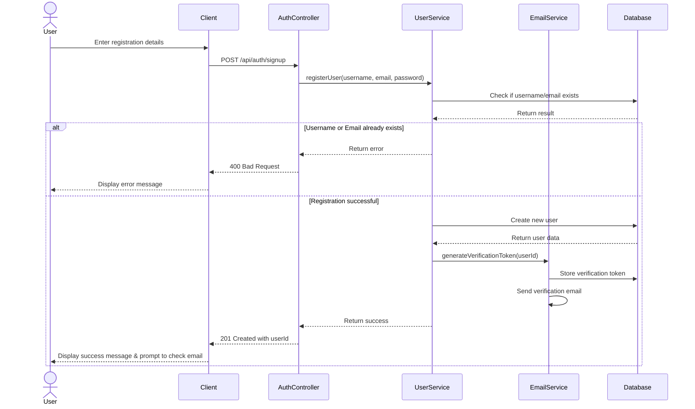
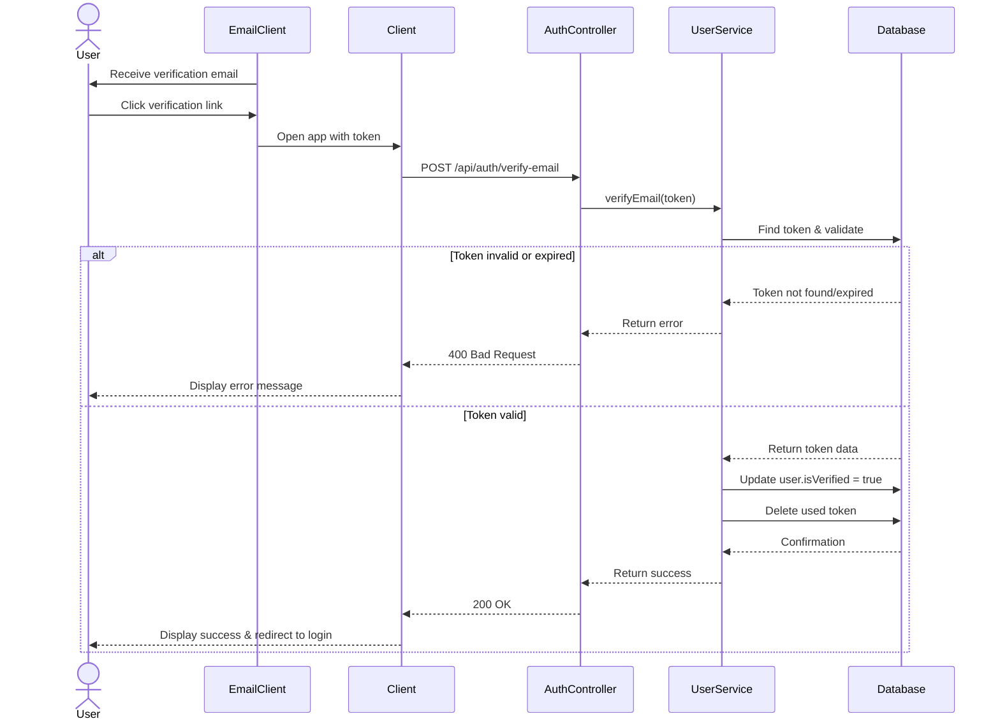
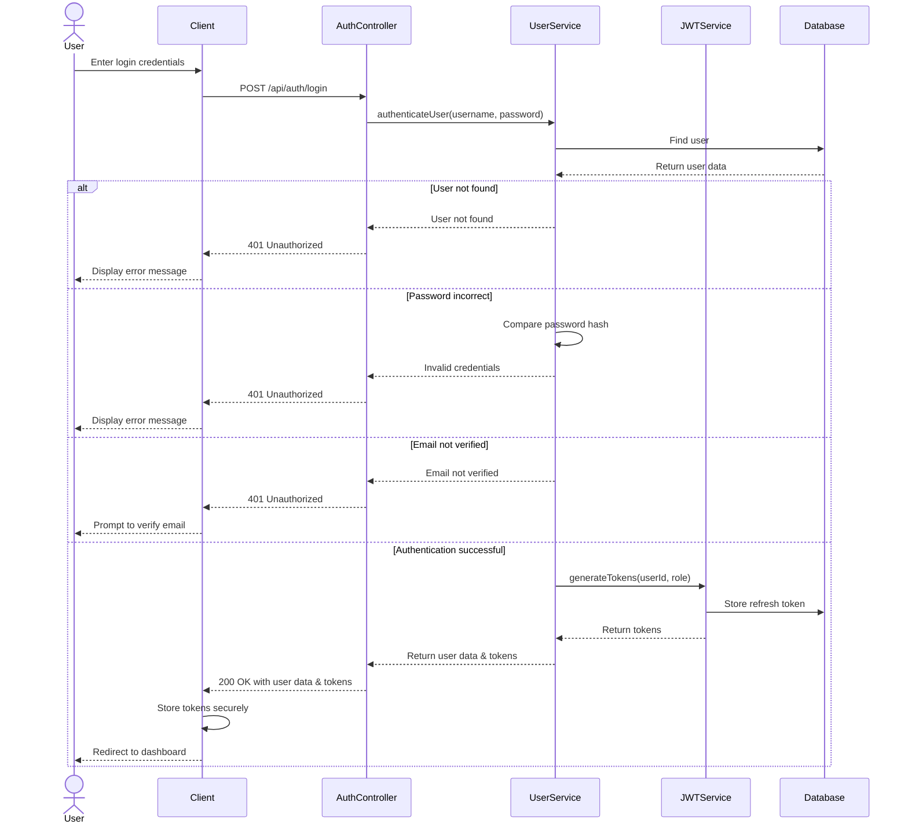
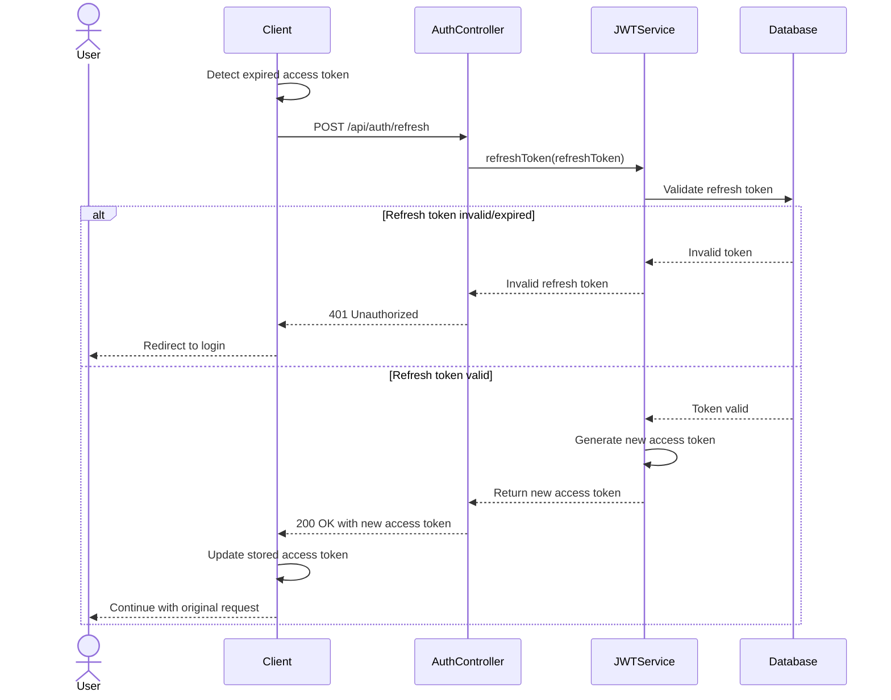
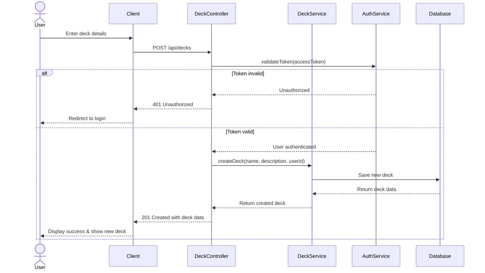
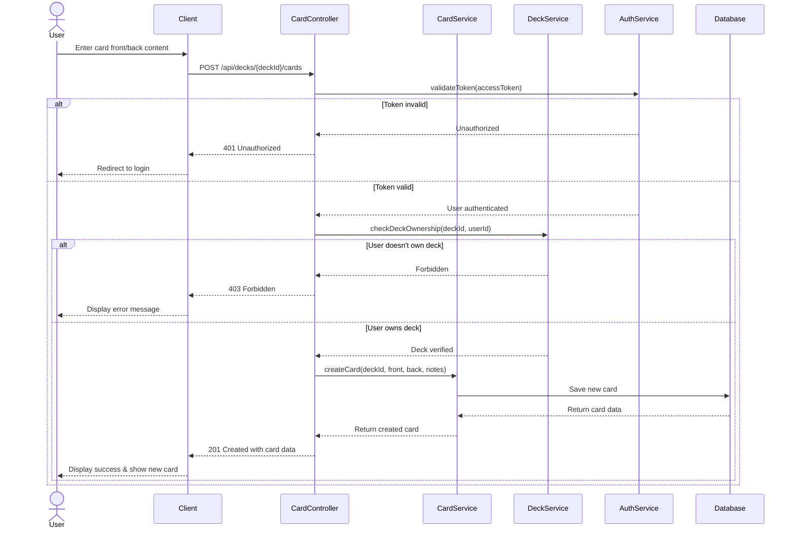
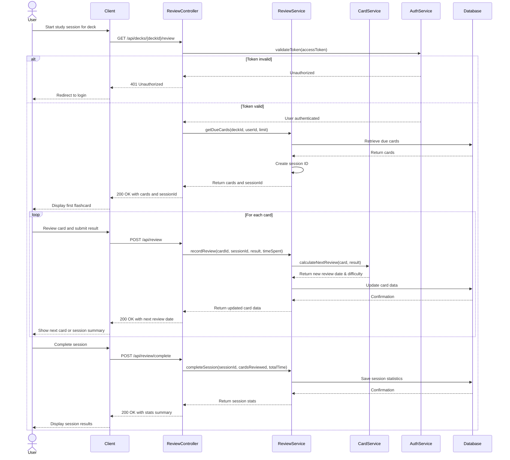
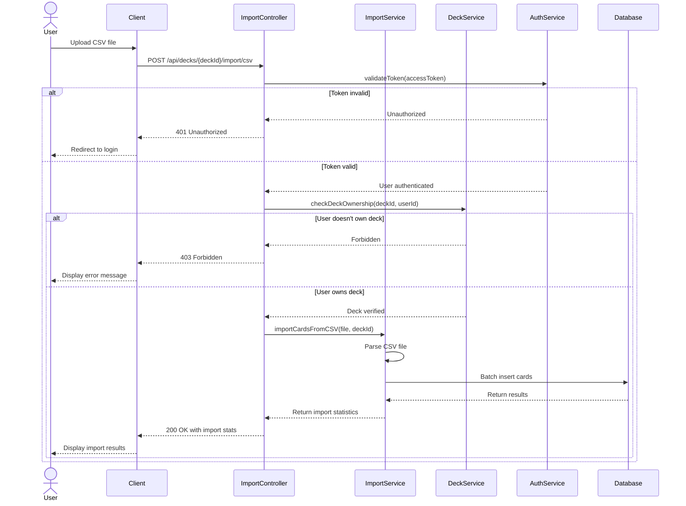
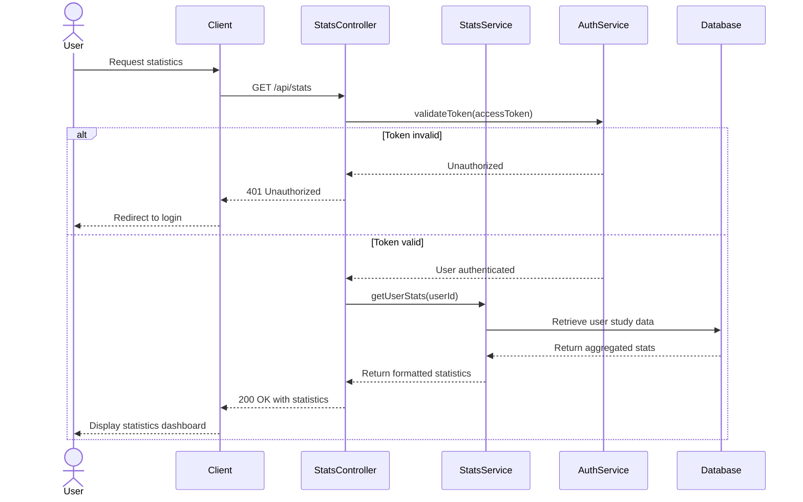
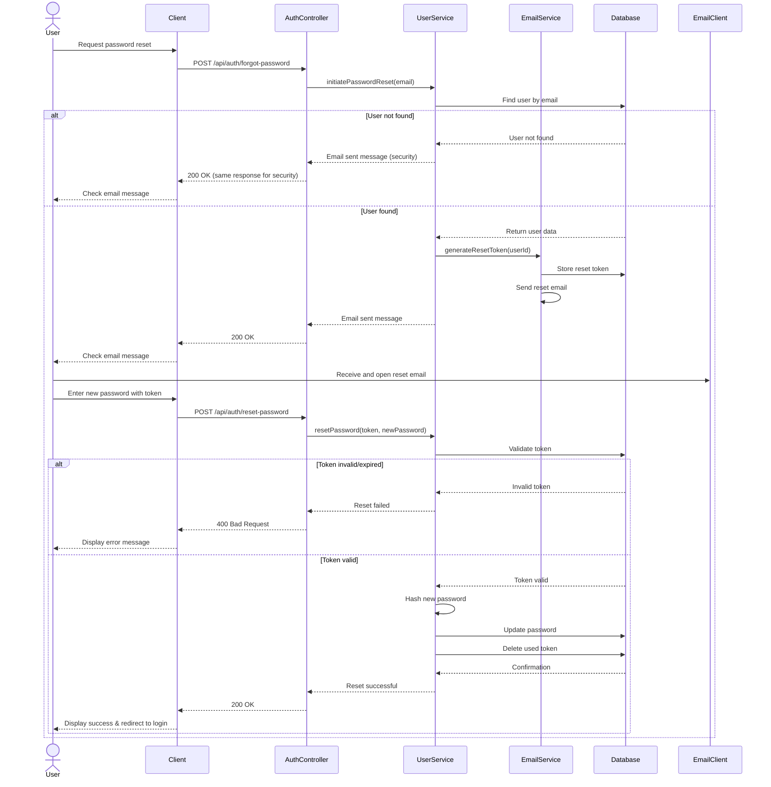

# Authentication and Flashcard App Flow Sequences

Below are the mermaid diagrams showing the flow sequences for user registration, login, and flashcard functionality.

## User Registration Flow

## Email Verification Flow

## Login Flow

## Token Refresh Flow

## Create Flashcard Deck Flow

## Create Flashcard Flow

## Study Session Flow

## Import Cards Flow

## View Statistics Flow

## Password Reset Flow

