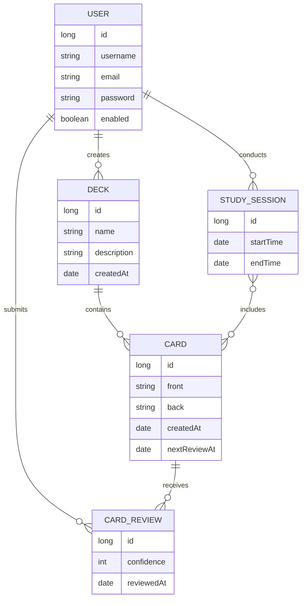
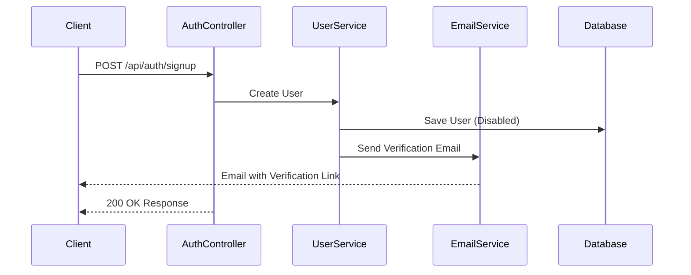
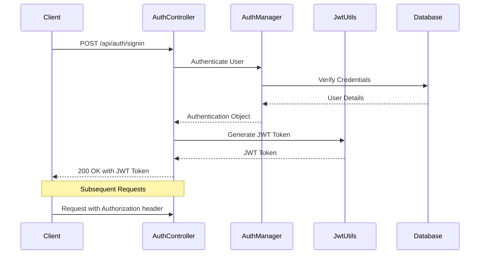
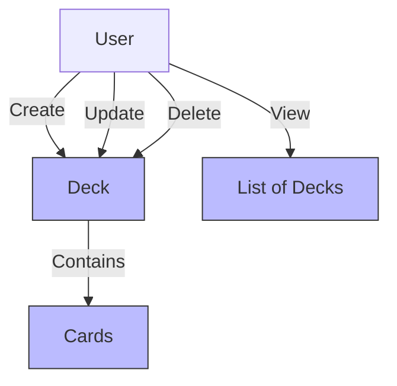
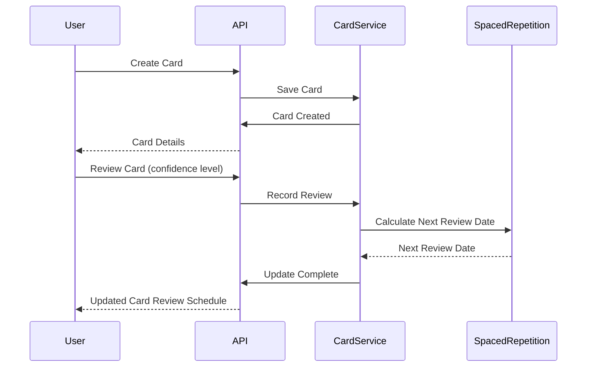
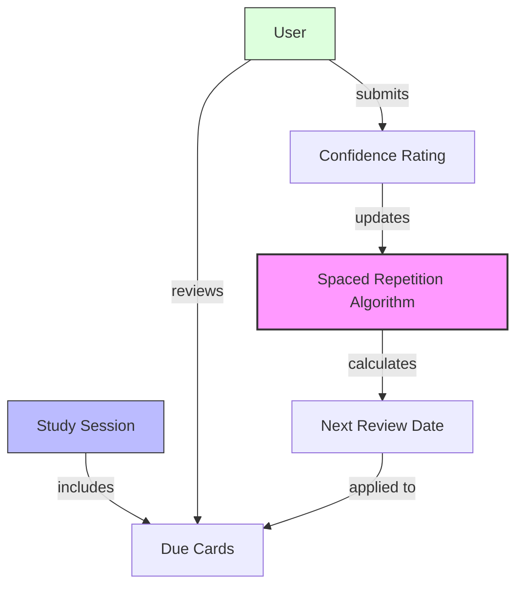
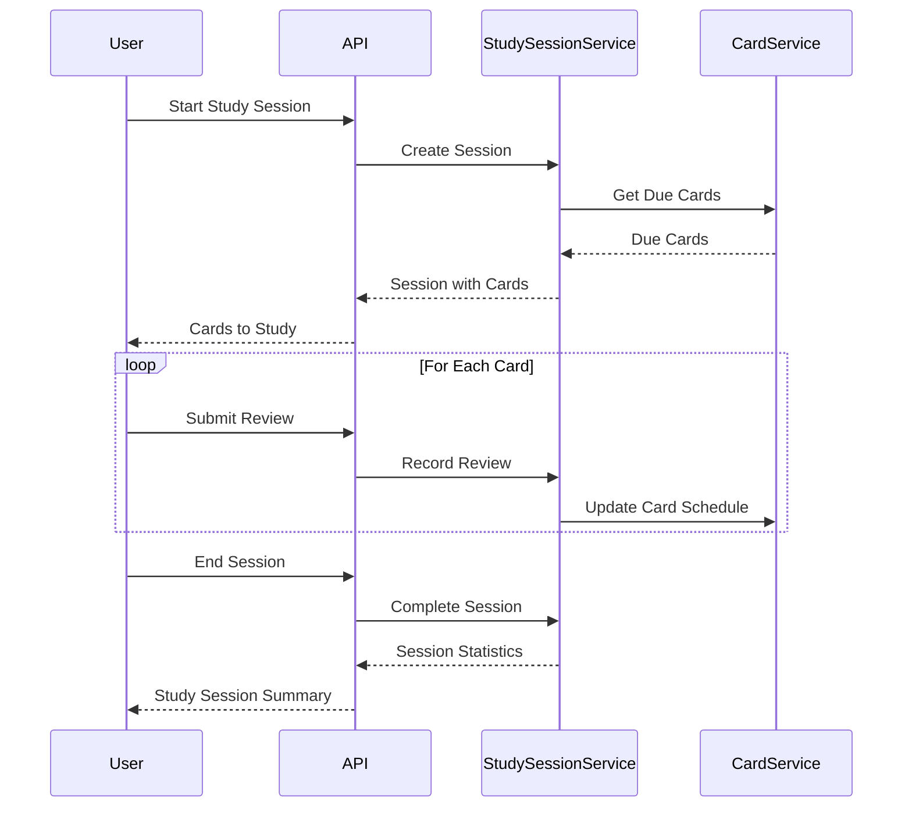

# Flashcard Application API Documentation

## Overview

This document provides a comprehensive guide to all endpoints available in the Flashcard Application REST API. It's designed for developers to understand and integrate with the backend system.

## Base URL

All endpoints are relative to:

- Development: `http://localhost:3000`
- Production: Your deployed API URL

## Authentication

The application uses JWT (JSON Web Token) for authentication:

- Access tokens expire after 15 minutes by default
- Include tokens in the Authorization header: `Authorization: Bearer <token>`
- Protected routes require authentication

## Response Status Codes

- 200 OK: Request succeeded
- 201 Created: Resource created successfully
- 400 Bad Request: Invalid input data
- 401 Unauthorized: Authentication required or failed
- 403 Forbidden: Permission denied for the requested resource
- 404 Not Found: Resource not found
- 500 Internal Server Error: Server error

## API Endpoints

### API Overview

```mermaid
graph TD
    A[Flashcard API] --> B[Authentication]
    A --> C[Decks]
    A --> D[Cards]
    A --> E[Card Reviews]
    A --> F[Study Sessions]
    
    B --> B1[Register]
    B --> B2[Login]
    B --> B3[Verify Email]
    
    C --> C1[Create Deck]
    C --> C2[Get User's Decks]
    C --> C3[Update Deck]
    C --> C4[Delete Deck]
    
    D --> D1[Create Card]
    D --> D2[Get Cards in Deck]
    D --> D3[Update Card]
    D --> D4[Delete Card]
    
    E --> E1[Submit Review]
    E --> E2[Get Card Reviews]
    
    F --> F1[Start Study Session]
    F --> F2[Get Due Cards]
    F --> F3[Get Review Stats]
    
    style A fill:#f9f,stroke:#333,stroke-width:2px
    style B fill:#bbf,stroke:#333
    style C fill:#bbf,stroke:#333
    style D fill:#bbf,stroke:#333
    style E fill:#bbf,stroke:#333
    style F fill:#bbf,stroke:#333
```



### Entity Relationships



### Authentication Endpoints

#### 1. Register a New User



- **URL**: `/api/auth/signup`
- **Method**: `POST`
- **Auth Required**: No
- **Description**: Creates a new user account and sends verification email
- **Request Body**:

```json
{
  "username": "user123",
  "email": "user@example.com",
  "password": "SecurePassword123"
}
```

- **Response (201 Created)**:

```json
{
  "userId": "1234567890",
  "message": "User registered successfully. Please verify your email."
}
```

- **Possible Errors**:
  - 400: Username already exists
  - 400: Email already in use

#### 2. Verify Email

**Endpoint**: `POST /api/auth/verify-email`

**Authentication**: None

**Request Body**:

```json
{
  "token": "verification-token-from-email"
}
```

**Response**:

- 200 OK: Verification successful

  ```json
  {
    "message": "Email verified successfully. You can now log in."
  }
  ```

- 400 Bad Request: Invalid token

  ```json
  {
    "message": "Error: Invalid or expired verification token!"
  }
  ```

#### 3. Resend Verification Email

- **URL**: `/api/auth/resend-verification`
- **Method**: `POST`
- **Auth Required**: No
- **Description**: Resends the verification email
- **Request Body**:

```json
{
  "email": "user@example.com"
}
```

- **Response (200 OK)**:

```json
{
  "message": "Verification email has been resent."
}
```

- **Possible Errors**:
  - 400: Email is required
  - 400: Email is already verified
  - 500: Failed to resend verification code

#### 4. Login



- **URL**: `/api/auth/login`
- **Method**: `POST`
- **Auth Required**: No
- **Description**: Authenticates user credentials and returns JWT tokens
- **Request Body**:

```json
{
  "email": "user@example.com",
  "password": "SecurePassword123"
}
```

- **Response (200 OK)**:

```json
{
  "accessToken": "eyJhbGciOiJIUzI1NiIsInR5cCI6IkpXVCJ9...",
  "refreshToken": "eyJhbGciOiJIUzI1NiIsInR5cCI6IkpXVCJ9...",
  "tokenType": "Bearer",
  "expiresIn": 900
}
```

- **Possible Errors**:
  - 401: Invalid credentials
  - 401: Email not verified

#### 5. Refresh Token

- **URL**: `/api/auth/refresh`
- **Method**: `POST`
- **Auth Required**: No
- **Description**: Creates a new access token using a valid refresh token
- **Request Body**:

```json
{
  "refreshToken": "eyJhbGciOiJIUzI1NiIsInR5cCI6IkpXVCJ9..."
}
```

- **Response (200 OK)**:

```json
{
  "accessToken": "eyJhbGciOiJIUzI1NiIsInR5cCI6IkpXVCJ9...",
  "tokenType": "Bearer",
  "expiresIn": 900
}
```

- **Possible Errors**:
  - 400: Refresh token is required
  - 401: Invalid refresh token
  - 500: Token refresh failed

#### 6. Logout

- **URL**: `/api/auth/logout`
- **Method**: `POST`
- **Auth Required**: No
- **Description**: Invalidates the current refresh token
- **Request Body**:

```json
{
  "refreshToken": "eyJhbGciOiJIUzI1NiIsInR5cCI6IkpXVCJ9..."
}
```

- **Response (200 OK)**:

```json
{
  "message": "Logged out successfully"
}
```

#### 7. Logout from All Devices

- **URL**: `/api/auth/logout-all`
- **Method**: `POST`
- **Auth Required**: Yes
- **Description**: Invalidates all refresh tokens for the current user
- **Response (200 OK)**:

```json
{
  "message": "Logged out from all devices successfully"
}
```

#### 8. Request Password Reset

- **URL**: `/api/auth/forgot-password`
- **Method**: `POST`
- **Auth Required**: No
- **Description**: Sends a password reset email to the user
- **Request Body**:

```json
{
  "email": "user@example.com"
}
```

- **Response (200 OK)**:

```json
{
  "message": "If the email exists, a password reset link has been sent."
}
```

- **Security Note**: For security purposes, this endpoint returns 200 OK even if the email is not found in the system

#### 9. Reset Password

- **URL**: `/api/auth/reset-password`
- **Method**: `POST`
- **Auth Required**: No
- **Description**: Resets a user's password using the token sent via email
- **Request Body**:

```json
{
  "token": "reset-token-from-email",
  "newPassword": "NewSecurePassword123"
}
```

- **Response (200 OK)**:

```json
{
  "message": "Password has been reset successfully."
}
```

- **Possible Errors**:
  - 400: Token and new password are required
  - 400: Token expired
  - 400: Password reset failed

### Deck Management

#### 10. Get All Decks



- **URL**: `/api/decks`
- **Method**: `GET`
- **Auth Required**: Yes
- **Description**: Returns all flashcard decks belonging to the authenticated user
- **Response (200 OK)**:

```json
{
  "decks": [
    {
      "id": "deck123",
      "name": "Spanish Vocabulary",
      "description": "Basic Spanish words and phrases",
      "cardCount": 42,
      "createdAt": "2023-05-10T14:30:00Z",
      "updatedAt": "2023-05-15T09:45:00Z",
      "lastStudied": "2023-05-14T10:20:00Z"
    },
    {
      "id": "deck456",
      "name": "JavaScript Concepts",
      "description": "Core JavaScript programming concepts",
      "cardCount": 35,
      "createdAt": "2023-04-20T11:15:00Z",
      "updatedAt": "2023-05-14T16:20:00Z"
    }
  ]
}
```

#### 11. Get Deck Details

- **URL**: `/api/decks/{deckId}`
- **Method**: `GET`
- **Auth Required**: Yes
- **Description**: Returns details of a specific deck
- **Path Parameters**:
  - deckId: The ID of the deck
- **Response (200 OK)**:

```json
{
  "id": "deck123",
  "name": "Spanish Vocabulary",
  "description": "Basic Spanish words and phrases",
  "cardCount": 42,
  "createdAt": "2023-05-10T14:30:00Z",
  "updatedAt": "2023-05-15T09:45:00Z",
  "lastStudied": "2023-05-14T10:20:00Z"
}
```

- **Possible Errors**:
  - 404: Deck not found

#### 12. Create New Deck

- **URL**: `/api/decks`
- **Method**: `POST`
- **Auth Required**: Yes
- **Description**: Creates a new flashcard deck
- **Request Body**:

```json
{
  "name": "French Basics",
  "description": "Essential French vocabulary and phrases"
}
```

- **Response (201 Created)**:

```json
{
  "id": "deck789",
  "name": "French Basics",
  "description": "Essential French vocabulary and phrases",
  "cardCount": 0,
  "createdAt": "2023-05-17T08:25:00Z",
  "updatedAt": "2023-05-17T08:25:00Z"
}
```

#### 13. Update Deck

- **URL**: `/api/decks/{deckId}`
- **Method**: `PUT`
- **Auth Required**: Yes
- **Description**: Updates the details of an existing deck
- **Path Parameters**:
  - deckId: The ID of the deck
- **Request Body**:

```json
{
  "name": "French Vocabulary - Advanced",
  "description": "Advanced French vocabulary and expressions"
}
```

- **Response (200 OK)**:

```json
{
  "id": "deck789",
  "name": "French Vocabulary - Advanced",
  "description": "Advanced French vocabulary and expressions",
  "cardCount": 0,
  "createdAt": "2023-05-17T08:25:00Z",
  "updatedAt": "2023-05-17T09:10:00Z"
}
```

- **Possible Errors**:
  - 400: Deck not found or you don't have access to this deck

#### 14. Delete Deck

- **URL**: `/api/decks/{deckId}`
- **Method**: `DELETE`
- **Auth Required**: Yes
- **Description**: Deletes a deck and all its cards
- **Path Parameters**:
  - deckId: The ID of the deck
- **Response (200 OK)**:

```json
{
  "message": "Deck deleted successfully"
}
```

- **Possible Errors**:
  - 400: Deck not found or you don't have access to this deck

### Card Management



#### 15. Get Cards in Deck

- **URL**: `/api/decks/{deckId}/cards`
- **Method**: `GET`
- **Auth Required**: Yes
- **Description**: Returns all cards in a specific deck
- **Path Parameters**:
  - deckId: The ID of the deck
- **Query Parameters**:
  - page: Page number (default: 0)
  - size: Items per page (default: 10)
  - sort: Field to sort by, followed by direction (default: "id,asc")
- **Response (200 OK)**:

```json
{
  "cards": [
    {
      "id": "card123",
      "front": "Hola",
      "back": "Hello",
      "notes": "Basic greeting",
      "difficulty": 3,
      "nextReviewDate": "2023-05-18T15:00:00Z",
      "reviewCount": 3,
      "createdAt": "2023-05-10T15:00:00Z",
      "updatedAt": "2023-05-15T09:45:00Z"
    }
  ],
  "currentPage": 0,
  "totalItems": 42,
  "totalPages": 5
}
```

- **Possible Errors**:
  - 404: Deck not found or you don't have access to this deck

#### 16. Get Card Details

- **URL**: `/api/decks/{deckId}/cards/{cardId}`
- **Method**: `GET`
- **Auth Required**: Yes
- **Description**: Returns details of a specific card
- **Path Parameters**:
  - deckId: The ID of the deck
  - cardId: The ID of the card
- **Response (200 OK)**:

```json
{
  "id": "card123",
  "front": "Hola",
  "back": "Hello",
  "notes": "Basic greeting",
  "difficulty": 3,
  "nextReviewDate": "2023-05-18T15:00:00Z",
  "reviewCount": 3,
  "createdAt": "2023-05-10T15:00:00Z",
  "updatedAt": "2023-05-15T09:45:00Z"
}
```

- **Possible Errors**:
  - 404: Card not found

#### 17. Get Cards Due for Review



- **URL**: `/api/decks/{deckId}/review-cards`
- **Method**: `GET`
- **Auth Required**: Yes
- **Description**: Returns cards due for review based on the spaced repetition algorithm
- **Path Parameters**:
  - deckId: The ID of the deck
- **Query Parameters**:
  - limit: Maximum number of cards to return (default: 10)
- **Response (200 OK)**:

```json
{
  "cards": [
    {
      "id": "card123",
      "front": "Hola",
      "back": "Hello",
      "notes": "Basic greeting",
      "difficulty": 3,
      "nextReviewDate": "2023-05-18T15:00:00Z",
      "reviewCount": 3
    }
  ],
  "totalDue": 8
}
```

- **Possible Errors**:
  - 404: Deck not found or you don't have access to this deck

#### 18. Create Card

- **URL**: `/api/decks/{deckId}/cards`
- **Method**: `POST`
- **Auth Required**: Yes
- **Description**: Creates a new flashcard in the specified deck
- **Path Parameters**:
  - deckId: The ID of the deck
- **Request Body**:

```json
{
  "front": "Buenos días",
  "back": "Good morning",
  "notes": "Morning greeting"
}
```

- **Response (201 Created)**:

```json
{
  "id": "card126",
  "front": "Buenos días",
  "back": "Good morning",
  "notes": "Morning greeting",
  "difficulty": 0,
  "nextReviewDate": "2023-05-18T10:00:00Z",
  "reviewCount": 0,
  "createdAt": "2023-05-17T10:00:00Z",
  "updatedAt": "2023-05-17T10:00:00Z"
}
```

- **Possible Errors**:
  - 404: Deck not found or you don't have access to this deck

#### 19. Update Card

- **URL**: `/api/decks/{deckId}/cards/{cardId}`
- **Method**: `PUT`
- **Auth Required**: Yes
- **Description**: Updates an existing flashcard
- **Path Parameters**:
  - deckId: The ID of the deck
  - cardId: The ID of the card
- **Request Body**:

```json
{
  "front": "Buenos días",
  "back": "Good morning / Good day",
  "notes": "Morning or daytime greeting"
}
```

- **Response (200 OK)**:

```json
{
  "id": "card126",
  "front": "Buenos días",
  "back": "Good morning / Good day",
  "notes": "Morning or daytime greeting",
  "difficulty": 0,
  "nextReviewDate": "2023-05-18T10:00:00Z",
  "reviewCount": 0,
  "createdAt": "2023-05-17T10:00:00Z",
  "updatedAt": "2023-05-17T10:15:00Z"
}
```

- **Possible Errors**:
  - 404: Card not found
  - 404: Deck not found or you don't have access to this deck

#### 20. Delete Card

- **URL**: `/api/decks/{deckId}/cards/{cardId}`
- **Method**: `DELETE`
- **Auth Required**: Yes
- **Description**: Deletes a specific card
- **Path Parameters**:
  - deckId: The ID of the deck
  - cardId: The ID of the card
- **Response (200 OK)**:

```json
{
  "message": "Card deleted successfully"
}
```

- **Possible Errors**:
  - 404: Card not found
  - 404: Deck not found or you don't have access to this deck

### Study Session Management



#### 21. Get All Study Sessions

- **URL**: `/api/study-sessions`
- **Method**: `GET`
- **Auth Required**: Yes
- **Description**: Returns all study sessions for the authenticated user
- **Query Parameters**:
  - page: Page number (default: 0)
  - size: Items per page (default: 10)
  - sort: Field to sort by, followed by direction (default: "startedAt,desc")
- **Response (200 OK)**:

```json
{
  "sessions": [
    {
      "id": "session123",
      "deckId": "deck123",
      "deckName": "Spanish Vocabulary",
      "startedAt": "2023-05-15T19:30:00Z",
      "completedAt": "2023-05-15T19:45:00Z",
      "cardsStudied": 15,
      "cardsCorrect": 12,
      "timeSpentSeconds": 900
    }
  ],
  "currentPage": 0,
  "totalItems": 22,
  "totalPages": 3
}
```

#### 22. Get Study Session Details

- **URL**: `/api/study-sessions/{sessionId}`
- **Method**: `GET`
- **Auth Required**: Yes
- **Description**: Returns details of a specific study session
- **Path Parameters**:
  - sessionId: The unique session ID
- **Response (200 OK)**:

```json
{
  "id": "session123",
  "deckId": "deck123",
  "deckName": "Spanish Vocabulary",
  "startedAt": "2023-05-15T19:30:00Z",
  "completedAt": "2023-05-15T19:45:00Z",
  "cardsStudied": 15,
  "cardsCorrect": 12,
  "timeSpentSeconds": 900,
  "reviews": [
    {
      "cardId": "card123",
      "front": "Hola",
      "back": "Hello",
      "result": 5,
      "reviewedAt": "2023-05-15T19:31:00Z",
      "timeSpentSeconds": 3
    }
  ]
}
```

- **Possible Errors**:
  - 403: You don't have access to this study session
  - 404: Study session not found

#### 23. Start Study Session

- **URL**: `/api/decks/{deckId}/study-sessions`
- **Method**: `POST`
- **Auth Required**: Yes
- **Description**: Creates a new study session for the specified deck
- **Path Parameters**:
  - deckId: The ID of the deck
- **Response (201 Created)**:

```json
{
  "sessionId": "session124",
  "deckId": "deck123",
  "deckName": "Spanish Vocabulary",
  "startedAt": "2023-05-17T14:00:00Z",
  "cardsAvailable": 8
}
```

- **Possible Errors**:
  - 404: Deck not found or you don't have access to this deck

#### 24. Complete Study Session

- **URL**: `/api/study-sessions/{sessionId}/complete`
- **Method**: `PUT`
- **Auth Required**: Yes
- **Description**: Marks a study session as complete and records statistics
- **Path Parameters**:
  - sessionId: The unique session ID
- **Request Body**:

```json
{
  "cardsReviewed": 10,
  "correctResponses": 8,
  "incorrectResponses": 2,
  "totalTimeSeconds": 840
}
```

- **Response (200 OK)**:

```json
{
  "id": "session124",
  "deckId": "deck123",
  "deckName": "Spanish Vocabulary",
  "startedAt": "2023-05-17T14:00:00Z",
  "completedAt": "2023-05-17T14:14:00Z",
  "cardsStudied": 10,
  "cardsCorrect": 8,
  "timeSpentSeconds": 840
}
```

- **Possible Errors**:
  - 403: You don't have access to this study session
  - 404: Study session not found

### Card Review Management

#### 25. Submit Card Review

- **URL**: `/api/study-sessions/{sessionId}/reviews`
- **Method**: `POST`
- **Auth Required**: Yes
- **Description**: Records the result of a card review and updates its spaced repetition data
- **Path Parameters**:
  - sessionId: The unique session ID
- **Request Body**:

```json
{
  "card": {
    "id": "card123"
  },
  "result": 4,
  "timeSpentSeconds": 5
}
```

- **Result Parameter**: Uses a 0-5 scale
  - 0: Incorrect answer
  - 1-5: Correct answer with varying difficulty (1 = hardest, 5 = easiest)
- **Response (201 Created)**:

```json
{
  "id": "review123",
  "cardId": "card123",
  "sessionId": "session124",
  "result": 4,
  "timeSpentSeconds": 5,
  "reviewedAt": "2023-05-17T14:02:00Z",
  "nextReviewDate": "2023-05-20T14:02:00Z"
}
```

- **Possible Errors**:
  - 400: Card does not belong to the deck being studied
  - 403: You don't have access to this study session
  - 404: Card not found
  - 404: Study session not found

#### 26. Get Card Review History

- **URL**: `/api/cards/{cardId}/reviews`
- **Method**: `GET`
- **Auth Required**: Yes
- **Description**: Returns the review history for a specific card
- **Path Parameters**:
  - cardId: The ID of the card
- **Response (200 OK)**:

```json
{
  "cardId": "card123",
  "reviews": [
    {
      "id": "review123",
      "sessionId": "session124",
      "result": 4,
      "timeSpentSeconds": 5,
      "reviewedAt": "2023-05-17T14:02:00Z"
    },
    {
      "id": "review120",
      "sessionId": "session123",
      "result": 3,
      "timeSpentSeconds": 8,
      "reviewedAt": "2023-05-15T19:35:00Z"
    }
  ],
  "statistics": {
    "totalReviews": 3,
    "correctCount": 2,
    "incorrectCount": 1,
    "averageTimeSeconds": 7.6,
    "successRate": 66.7
  }
}
```

- **Possible Errors**:
  - 403: You don't have access to this card
  - 404: Card not found

### Statistics and Analytics

#### 27. Get Study Activity

- **URL**: `/api/stats/study-activity`
- **Method**: `GET`
- **Auth Required**: Yes
- **Description**: Returns user's study statistics and activity data
- **Query Parameters**:
  - days: Number of days to include in statistics (default: 7)
- **Response (200 OK)**:

```json
{
  "period": "7 days",
  "completedSessions": 12,
  "totalCardsStudied": 145,
  "totalTimeSpentMinutes": 120,
  "averageCorrectPercentage": 78.5,
  "currentStreak": 3,
  "longestStreak": 5
}
```

### System Health

#### 28. Health Check

- **URL**: `/health`
- **Method**: `GET`
- **Auth Required**: No
- **Description**: Confirms that the API is running properly
- **Response Example**:

```json
{
  "status": "UP",
  "version": "1.0.0"
}
```

## Best Practices for Frontend Integration

### Authentication Flow

1. Registration: Call the signup endpoint and store the userId
2. Email Verification: Prompt users to check their email and verify their account
3. Login: Authenticate and store both access and refresh tokens securely

### Token Management

- Include the access token in the Authorization header for all requests
- When requests fail with 401, try refreshing the access token
- If refresh fails, redirect to login

### Error Handling

- Implement global error handling for API responses
- Handle 401 errors by refreshing tokens or redirecting to login
- Display user-friendly messages for common errors

### Performance Tips

- Cache frequently accessed data like deck lists
- Use pagination for large collections of cards
- Batch operations for creating multiple cards at once
