# Debugging Email Notifications in Spring Boot Applications

This guide explains how to troubleshoot and fix email notification issues in Spring Boot applications, specifically for our Flashcard application. No prior Java knowledge is required to understand these solutions.

## Java and Spring Boot Fundamentals for Beginners

Before diving into debugging, let's understand some key concepts in Java and Spring Boot that you'll see throughout this guide:

### Understanding Annotations (@ Symbols)

In Java, the `@` symbols you see are called "annotations." They provide metadata about code elements and tell the Spring framework how to treat them:

- **@Service**: Marks a class as a service that performs business logic. Spring automatically creates and manages an instance of this class.
- **@Controller / @RestController**: Identifies a class that handles web requests. The difference is that `@RestController` automatically formats responses as JSON.
- **@Autowired**: Tells Spring to automatically inject (provide) an instance of a needed dependency.
- **@RequestMapping**: Maps web requests to specific handler methods.
- **@GetMapping / @PostMapping**: Shortcuts for handling HTTP GET/POST requests (similar to @RequestMapping).
- **@RequestParam**: Extracts parameters from the request URL.

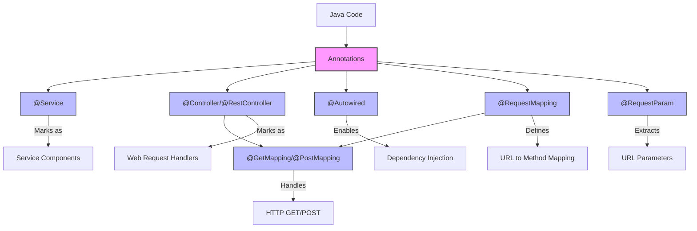

### Dependency Injection Explained

Dependency Injection (DI) is a core Spring concept that might seem confusing at first:

**What it is**: Instead of a class creating its own dependencies, they are "injected" (provided) by Spring.

**How it works**:

1. You mark a class with annotations like `@Service`
2. You declare dependencies using `@Autowired`
3. Spring automatically creates and connects all the pieces

**Example**:

```java
@Service  // "Hey Spring, manage this class for me"
public class EmailService {
    @Autowired  // "Please give me a JavaMailSender"
    private JavaMailSender emailSender;
    
    // Now we can use emailSender without creating it ourselves
}
```

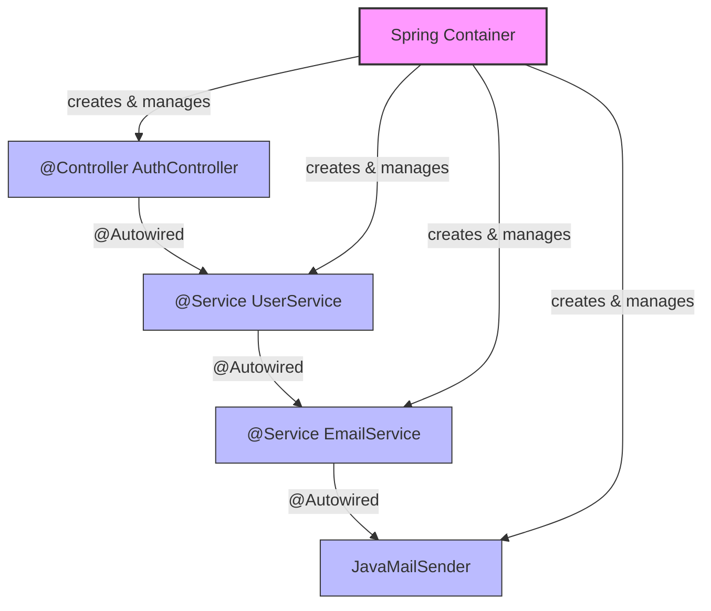

This approach makes code more testable and modular because:

- Services can be easily replaced with mock versions for testing
- Changes to one component don't require changes to every class that uses it

Now, with this understanding, the debugging steps below should make more sense even if you're new to Java.

### How Spring Boot Creates and Manages Class Instances

When you're wondering how Spring "automatically creates and manages" annotated classes, here's what happens behind the scenes:

**1. Component Scanning**:

- At startup, Spring scans your application for special annotations like `@Component`, `@Service`, `@Controller`, etc.
- It finds all these annotated classes and registers them as "beans" to be managed

**2. Bean Creation**:

- Spring creates instances (objects) of these classes
- This happens during application startup, not at compile time
- Spring uses reflection (a Java feature that lets code examine and modify itself during runtime)

**3. Bean Lifecycle Management**:

- Spring stores these instances in its "Application Context" (a container for all beans)
- Each bean typically has a single instance (singleton) shared throughout the application
- Spring handles initialization and destruction of these beans

**4. Bean Wiring**:

- When you use `@Autowired`, Spring examines what type of object you need
- It looks in its Application Context for a matching instance
- It "injects" (connects) the right instances together

**Example in Runtime Flow**:

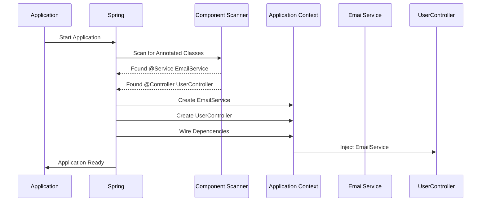

```mermaid
graph TD
    subgraph "Spring Boot Application Lifecycle"
    A[Application Starts] --> B[Component Scanning]
    B --> C[Bean Creation]
    C --> D[Dependency Injection]
    D --> E[Application Running]
    end
    
    subgraph "Bean Lifecycle"
    F[Bean Definition Found] --> G[Bean Instantiated]
    G --> H[Dependencies Injected]
    H --> I[Initialization Methods]
    I --> J[Bean Ready for Use]
    J --> K[Bean Destruction]
    end
    
    style A fill:#bbf,stroke:#333
    style E fill:#9f9,stroke:#333
    style J fill:#9f9,stroke:#333
```

Unlike regular Java where you would write `new EmailService()`, Spring handles object creation automatically. Your code simply declares what it needs, and Spring provides it at runtime.

This dynamic behavior happens after compilation, during the application's startup phase, which is why you won't see it in the compiled code.

## Common Email Notification Issues

If emails aren't showing up in MailHog (our test email service) when testing your application, follow these debugging steps:

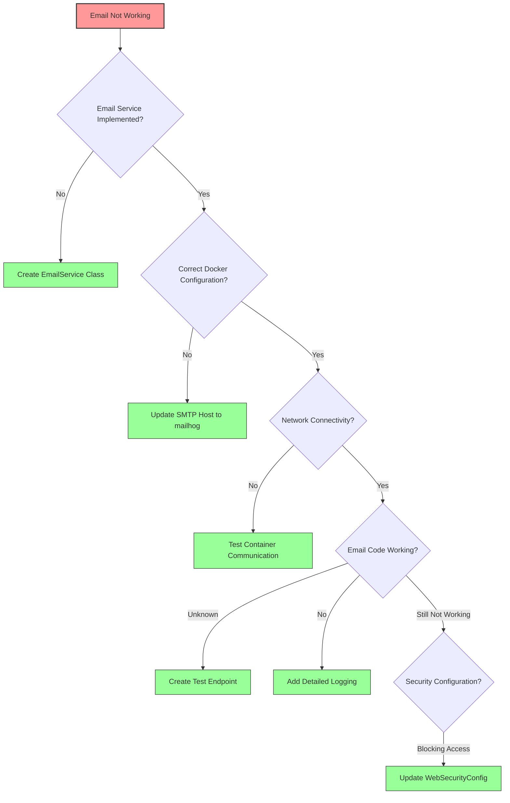

### 1. Check If Email Service Is Implemented

In our Flashcard application, we initially had "TODO" comments where email functionality should have been implemented:

```java
// TODO: Send verification email
```

**Solution**: We created a proper `EmailService` class that handles sending emails:

```java
@Service
public class EmailService {
    private static final Logger logger = LoggerFactory.getLogger(EmailService.class);

    @Autowired
    private JavaMailSender emailSender;

    // Email sending methods go here
}
```

### 2. Fix Network Configuration in Docker

When running in Docker containers, services can't connect to each other using "localhost" - they must use the service name defined in docker-compose.yml.

**Problem**: In application.properties:

```
spring.mail.host=localhost  # WRONG for Docker environment
```

**Solution**: In docker-compose.yml, use environment variables to override the properties:

```yaml
services:
  app:
    environment:
      - SPRING_MAIL_HOST=mailhog  # Correct! Uses service name
      - SPRING_MAIL_PORT=1025
```

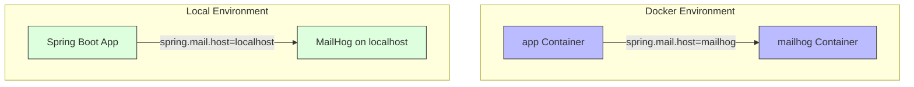

### 3. Check Network Connectivity Between Containers

You can verify if containers can communicate with each other using these commands:

```bash
# Test if app container can reach mailhog by hostname
docker exec app-container-name ping mailhog

# Test if app container can connect to the SMTP port
docker exec app-container-name nc -zv mailhog 1025
```

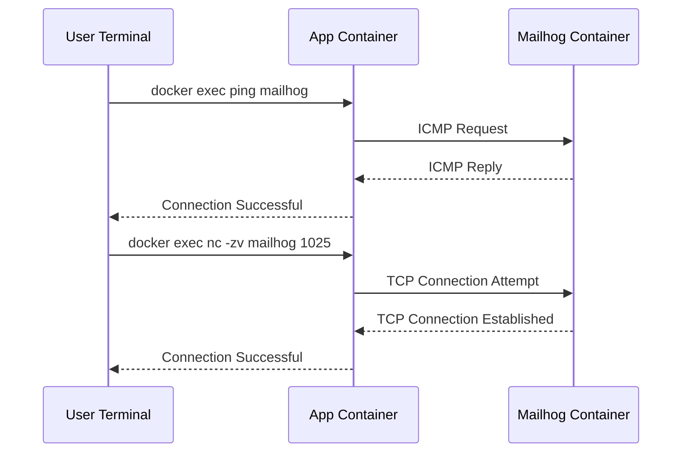

If these tests succeed but emails still aren't working, the issue is likely in the application code, not the network.

### 4. Test Email Functionality Directly

Create a simple test endpoint that directly triggers email sending:

```java
@RestController
@RequestMapping("/api/test")
public class TestController {
    @Autowired
    private EmailService emailService;

    @GetMapping("/send-test-email")
    public ResponseEntity<?> sendTestEmail(@RequestParam String email) {
        // Send test email code
    }
}
```

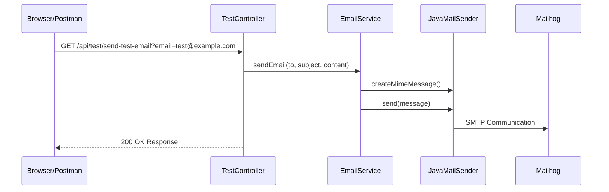

This lets you test email functionality without going through the full user registration flow.

### 5. Add Detailed Logging

Enhance your email service with detailed logging to see exactly what's happening:

```java
logger.info("Starting to send verification email to: {} with token: {}", to, token);
try {
    // Email sending code
    logger.info("Email sent successfully!");
} catch (Exception e) {
    logger.error("Failed to send email: {}", e.getMessage(), e);
}
```

### 6. Configure Security to Allow Test Endpoints

Spring Security blocks unauthenticated access to endpoints by default. Allow access to test endpoints by updating WebSecurityConfig:

```java
.authorizeRequests()
    .antMatchers("/api/auth/**").permitAll()
    .antMatchers("/api/test/**").permitAll()  // Allow access to test endpoints
    .anyRequest().authenticated();
```

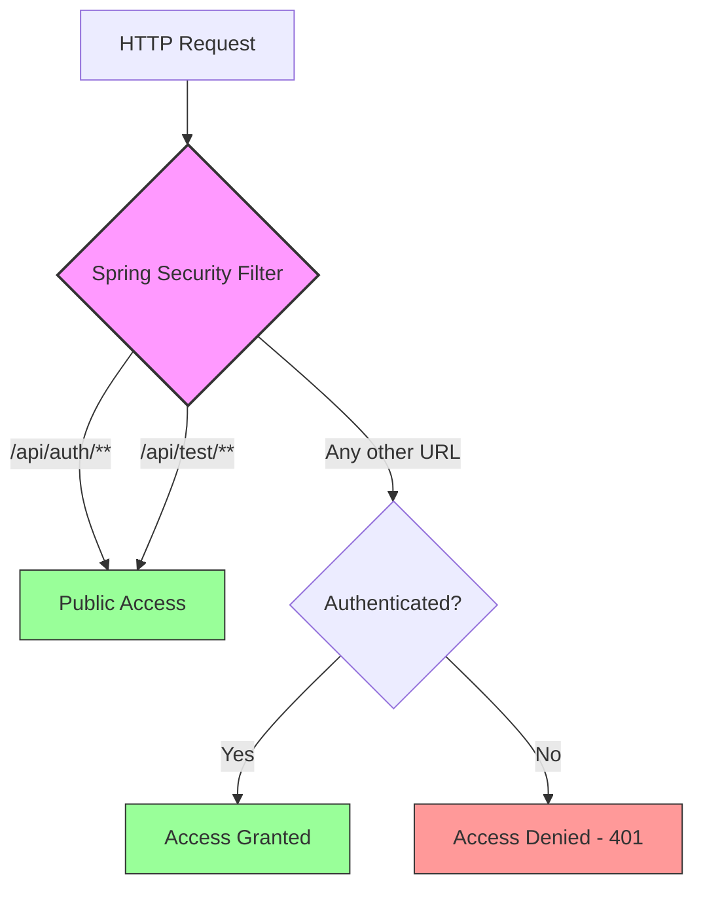

## Specific Email Configuration Issues

### Import Errors for Email Libraries

If you see errors like `MimeMessage cannot be resolved to a type`:

- Spring Boot 2.x (our version): Use `javax.mail` imports
- Spring Boot 3.x: Use `jakarta.mail` imports

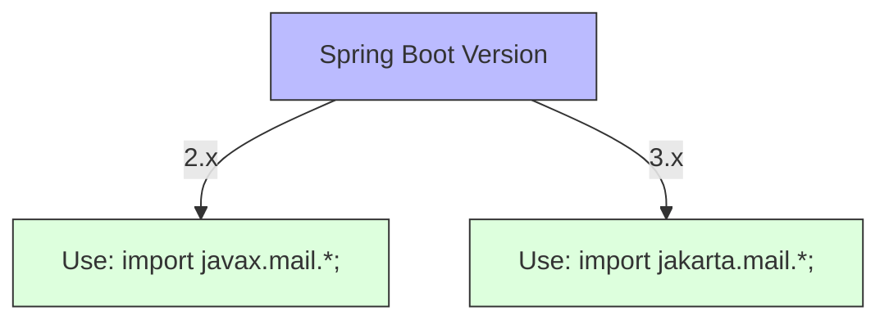

### Configuration Properties

Make sure these properties are set correctly:

```
# In application.properties or as environment variables
spring.mail.host=mailhog     # For Docker, use container name
spring.mail.port=1025        # Default MailHog SMTP port
spring.mail.properties.mail.smtp.auth=false
spring.mail.properties.mail.smtp.starttls.enable=false
spring.mail.properties.mail.from=noreply@yourapp.com
```

## Running Automated Tests with MailHog

Our automated test script `test_flashcard_api.py` has been enhanced to:

1. Automatically extract verification tokens from emails in MailHog
2. Detect and connect to MailHog through multiple possible URLs
3. Retry token extraction with different patterns and multiple attempts

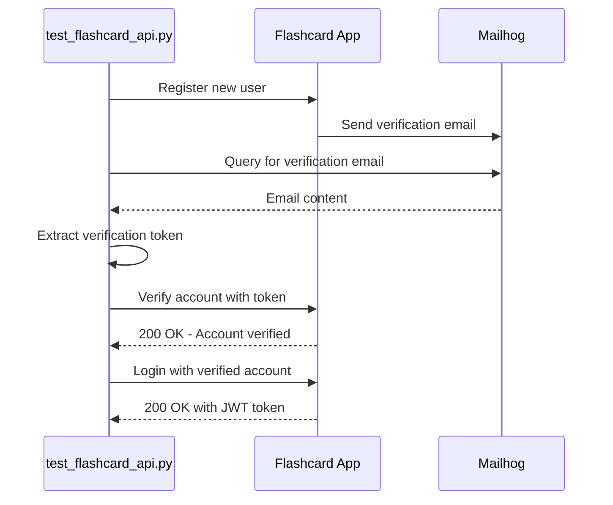

If you still have issues with automated tests:

```bash
# Run with increased wait time for emails
python tests/test_flashcard_api.py --auto --auto-verify --wait-email 15
```

## Complete Email Flow in the Flashcard Application

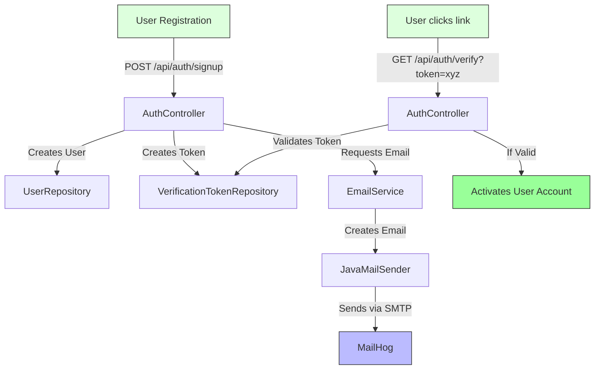

## Summary of Our Fixes

We fixed these specific issues:

1. Created a proper `EmailService` class to implement email sending
2. Updated Docker configuration to use the correct MailHog hostname
3. Created a test controller to directly verify email functionality
4. Enhanced logging to diagnose email sending issues
5. Updated security configuration to allow access to test endpoints
6. Fixed import statements for the correct mail package (javax.mail)

By following this guide, you should be able to troubleshoot and fix common email notification issues without needing detailed Java knowledge.
