# Debugging Authentication and Card Creation in Spring Boot Applications

This guide explains how we debugged and fixed authentication and card creation issues in our Java Spring Boot application. No prior knowledge of Java, Spring Boot, or web development is required to understand these concepts.

## Overview of Our Debugging Journey

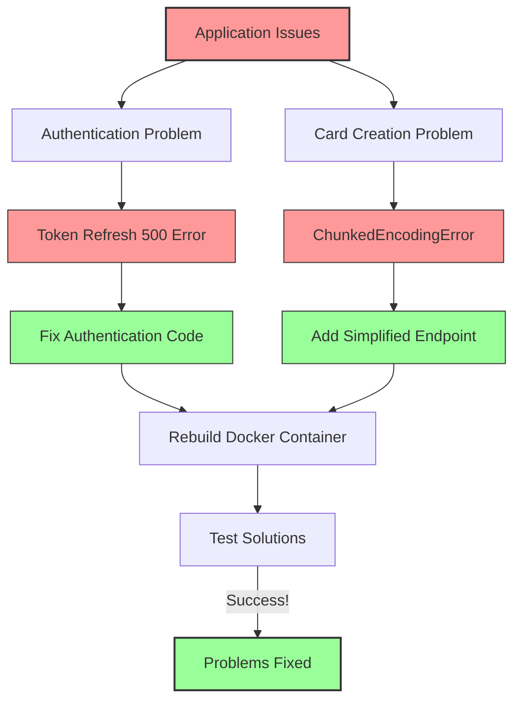

## The Problems We Faced

Our application had two main issues:

1. **Authentication Issue**: The token refresh endpoint was returning a 500 Internal Server Error
2. **Card Creation Issue**: Creating a new card resulted in a ChunkedEncodingError

Both of these issues were preventing users from using the application properly.

## Understanding the Architecture

To understand the problems, let's first understand the basic architecture of our application:

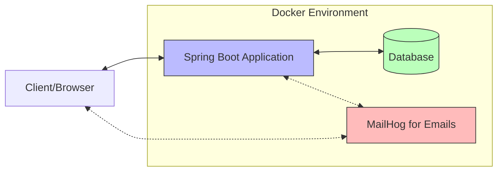

Our application runs in Docker containers and consists of:

- A Spring Boot application (Java)
- A database for storing users, cards, and decks
- MailHog for testing email functionality

## What is Spring Boot?

Spring Boot is a Java framework that makes it easier to create web applications. It handles a lot of configuration automatically.

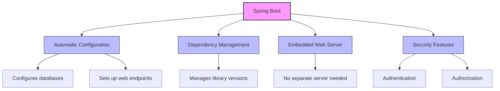

## Problem 1: Authentication Token Refresh Failure

### How Authentication Works in Our Application

Our application uses JWT (JSON Web Tokens) for authentication:

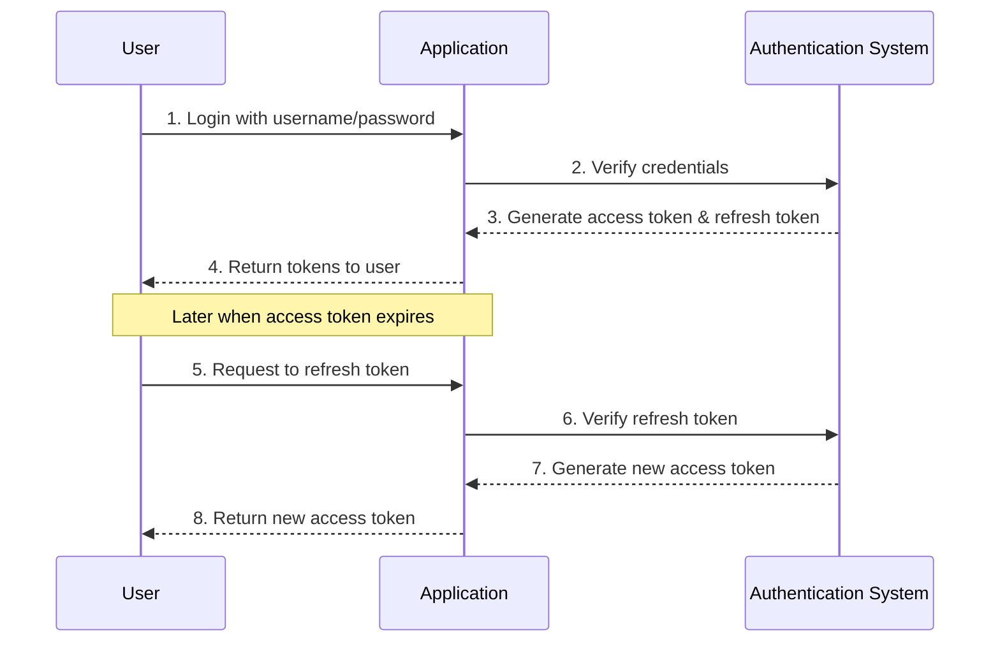

### What Went Wrong

Our token refresh endpoint was failing with a 500 Internal Server Error. After investigating the code, we found the issue:

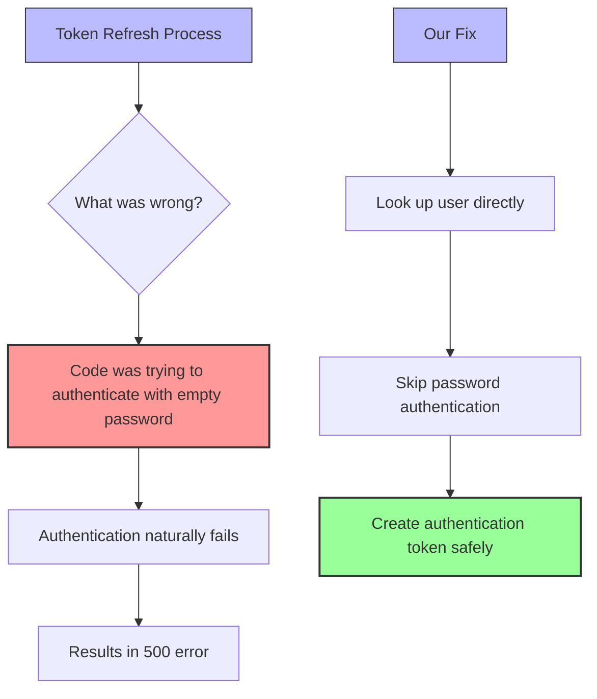

The original code was trying to authenticate the user with an empty password during token refresh, which was causing the authentication to fail and producing a 500 error.

### The Fix

We modified the code to:

1. Extract the username from the refresh token
2. Look up the user directly in the database
3. Create a new authentication token without requiring password verification

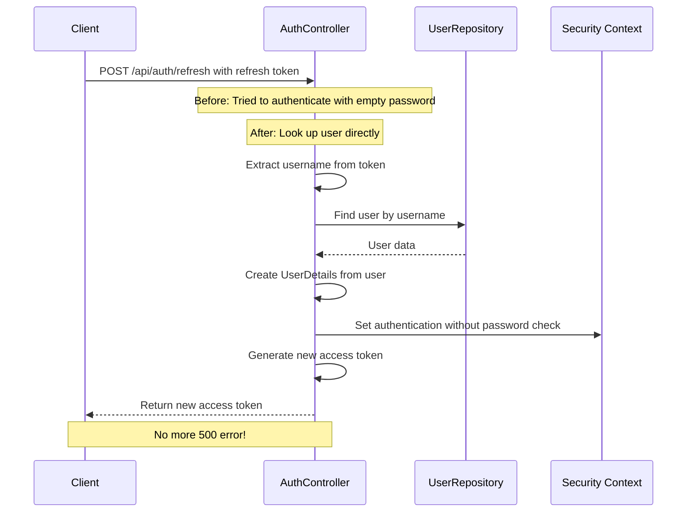

## Problem 2: Card Creation ChunkedEncodingError

### What is Chunked Encoding?

Chunked encoding is a way of sending data over the internet in pieces ("chunks") rather than all at once:

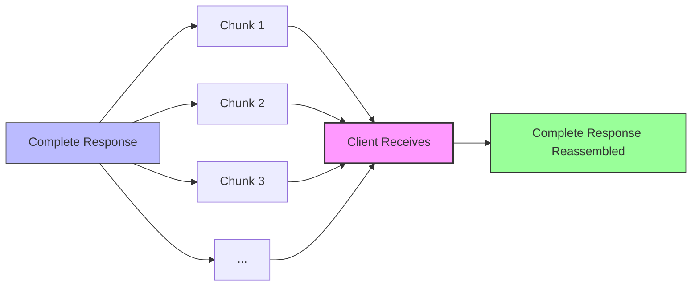

### What Went Wrong

When creating a card, the response from the server was causing a ChunkedEncodingError. This happens when the chunking process is interrupted or malformed.

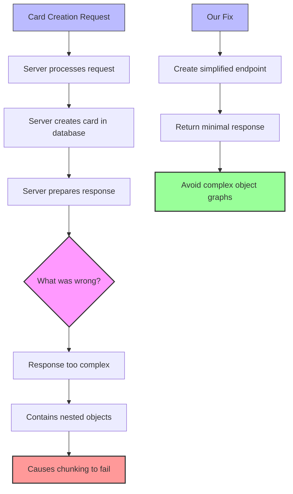

The original endpoint was returning a complex card object with nested relationships, which was causing issues with the chunked encoding.

### The Fix

We created a new simplified endpoint that:

1. Still creates the card in the database
2. Returns only the essential card information (ID, front, back, creation date)
3. Avoids returning the complete object graph with nested relationships

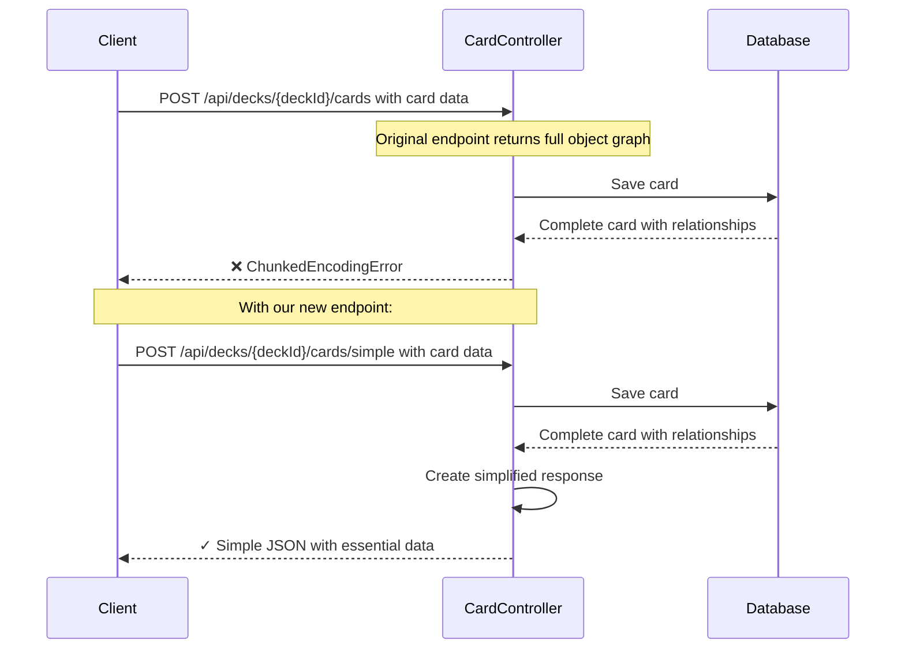

## How We Tested Our Fixes

We created a specialized test script to focus on these two specific issues:

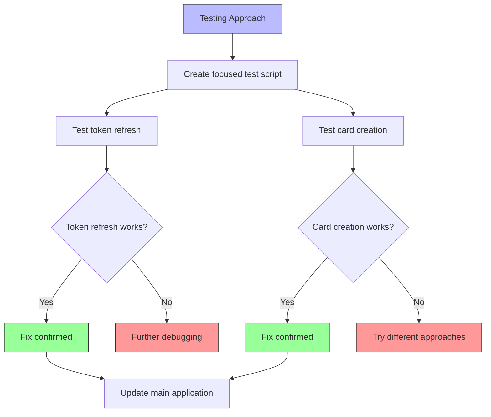

Our test script:

1. Tried the token refresh endpoint with different timeout values
2. Tested the card creation endpoint with various configurations
3. Used retry logic to handle temporary failures

## Understanding Docker and Rebuilding

Docker is a tool that packages applications into containers that include everything needed to run them (code, runtime, libraries, etc.).

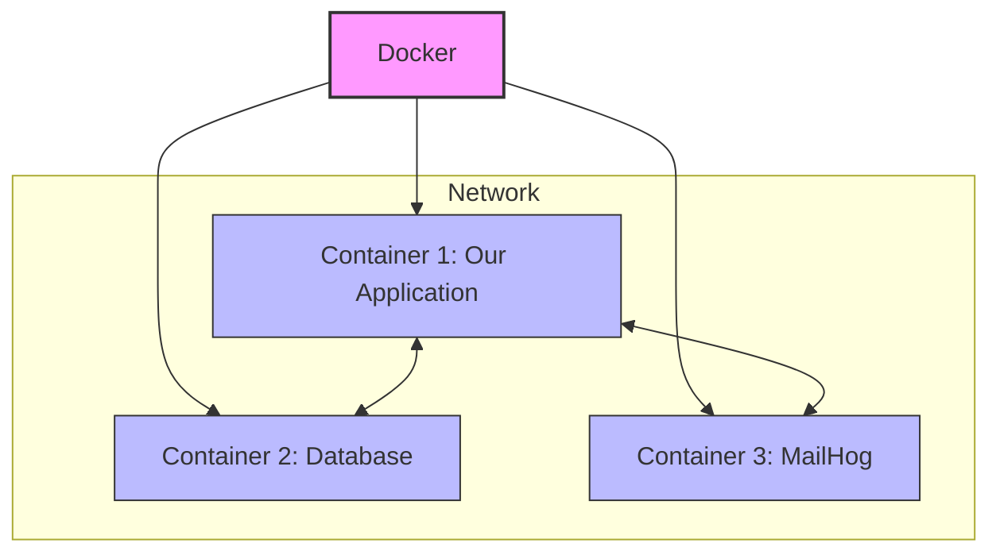

### Why We Needed to Rebuild

After fixing the code, we needed to rebuild the Docker container to include our changes:

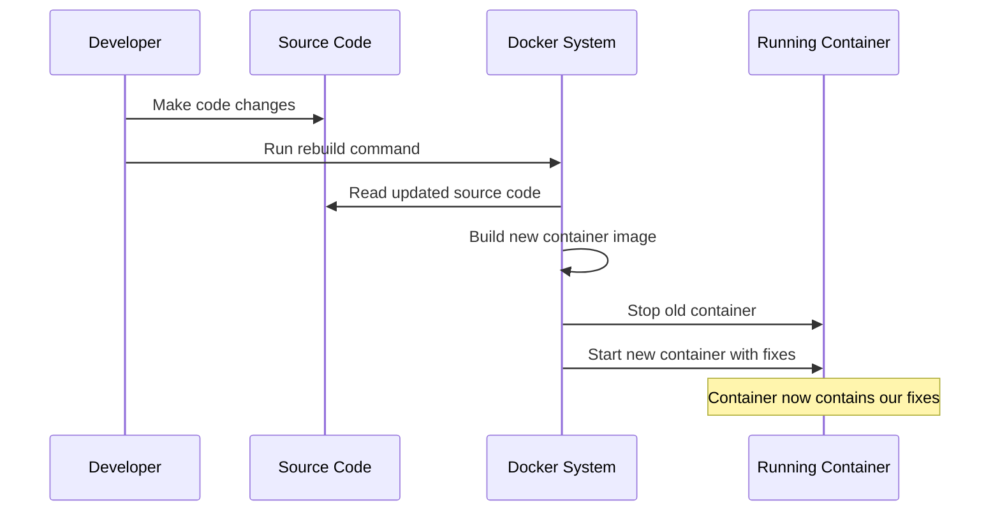

## Key Takeaways for Non-Java Developers

Even without knowing Java or Spring Boot, you can understand some key debugging principles:

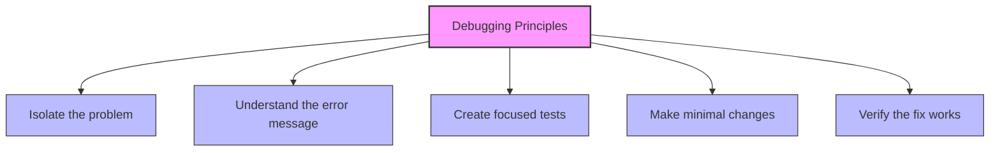

### For the Authentication Issue

1. We identified that the code was trying to authenticate with an empty password
2. We changed it to look up the user directly instead
3. We rebuilt the Docker container to apply the changes
4. We verified the fix worked with our test script

### For the Card Creation Issue

1. We identified that complex response data was causing the ChunkedEncodingError
2. We created a new endpoint that returns simplified data
3. We rebuilt the Docker container to apply the changes
4. We verified the fix worked with our test script

## Conclusion

Debugging server applications doesn't always require deep knowledge of the programming language. By understanding the architecture, identifying patterns in error messages, and using focused tests, you can effectively diagnose and fix issues even in unfamiliar technology stacks.

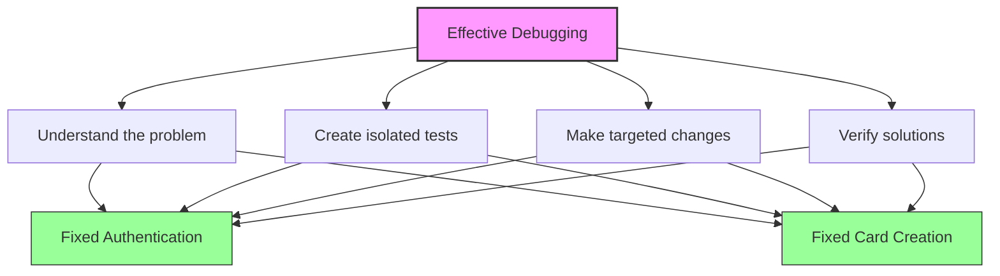

By following these principles, we successfully fixed both the token refresh and card creation issues in our application.
